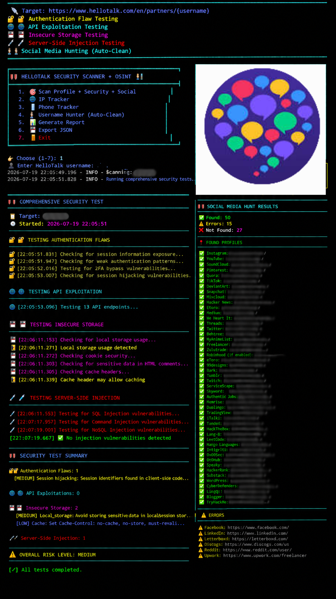

# HelloSpecter - HelloTalk Professional Security Scanner + OSINT Suite
# ⚠️ UNDER DEVELOPMENT - This tool is currently in active development. Features may be incomplete or subject to change.
<p align="center">
  
</p>
HelloSpecter is a comprehensive cybersecurity reconnaissance and vulnerability assessment tool designed for the HelloTalk social learning platform. It combines OSINT capabilities, security testing, and vulnerability scanning into a single unified framework.

---

📋 Table of Contents

· Overview
· Features
· Architecture
· Installation
· Usage
· Security Test Modules
· OSINT Capabilities
· Data Models
· Reporting & Export
· Disclaimer
· License

---

🔍 Overview

HelloSpecter is a professional-grade security assessment tool that performs:

· Profile Intelligence Gathering - Comprehensive extraction of public profile data
· Vulnerability Assessment - Detection of security flaws including authentication issues, API exploitation, insecure storage, and injection vulnerabilities
· OSINT Reconnaissance - Multi-platform username hunting with automatic sanitization
· IP Intelligence - Geolocation, ISP, and network information gathering
· Phone Number Intelligence - Carrier, location, and validation analysis (coming soon)

The tool is built for security researchers, penetration testers, and cybersecurity professionals to identify and document security weaknesses in the HelloTalk platform.

---

🚀 Features

🎯 Profile Intelligence

· Complete profile data extraction (name, bio, location, languages)
· Statistical analysis (followers, conversations, ratings, activity)
· Verification & premium status detection
· Data completeness scoring

🛡️ Security Testing

Test Category Description
Authentication Flaws Session exposure, weak auth patterns, 2FA bypass, session hijacking
API Exploitation Data leakage, excessive data exposure, unauthorized access
Insecure Storage Local storage analysis, cookie security, cache vulnerabilities
Server-Side Injection SQL Injection, Command Injection, NoSQL Injection

🕵️ OSINT Capabilities

· 80+ Platform Support: Facebook, Instagram, Twitter/X, LinkedIn, GitHub, TikTok, and more
· Automatic Username Sanitization: Removes prefixes like cv_, cd_, we_, ht_
· Variant Generation: Automatic testing of common username patterns
· Threaded Scanning: High-performance concurrent platform checking

🌐 IP Intelligence

· IP Tracking: Geolocation, ISP, ASN, timezone, coordinates with maps link

---

🏗️ Architecture

```
┌─────────────────────────────────────────────────────────────────────┐
│                    HelloSpecter Framework                          │
├─────────────────────────────────────────────────────────────────────┤
│                                                                     │
│  ┌─────────────┐  ┌─────────────┐  ┌─────────────┐  ┌───────────┐│
│  │   Profile    │  │   Security  │  │    OSINT    │  │  Data     ││
│  │   Scanner    │  │   Tester    │  │   Hunter    │  │  Export   ││
│  └──────┬──────┘  └──────┬──────┘  └──────┬──────┘  └─────┬─────┘│
│         │                │                │               │       │
│  ┌──────▼────────────────▼────────────────▼───────────────▼─────┐│
│  │                      Core Engine                              ││
│  │  - Session Management  - Rate Limiting  - Error Handling    ││
│  │  - Thread Pool         - User Agent Rotation                ││
│  └───────────────────────────────────────────────────────────────┘│
│                                                                     │
│  ┌───────────────────────────────────────────────────────────────┐│
│  │                    Output Layer                               ││
│  │  ┌──────────┐  ┌──────────┐  ┌──────────┐  ┌──────────┐    ││
│  │  │  JSON    │  │   CSV    │  │ Terminal │  │  Report  │    ││
│  │  └──────────┘  └──────────┘  └──────────┘  └──────────┘    ││
│  └───────────────────────────────────────────────────────────────┘│
└─────────────────────────────────────────────────────────────────────┘
```

---

📦 Installation

Prerequisites

· Python 3.8 or higher
· pip package manager

Quick Install

```bash
# Clone the repository
git clone https://github.com/sylhetyhackvenger/HelloSpecter
cd HelloSpecter 

# Install required packages
pip install -r requirements.txt

# Run the tool
first run tor in other session 
sudo python hellospecter.py
```

Requirements

```txt
requests>=2.28.0
beautifulsoup4>=4.11.0
fake-useragent>=1.4.0
colorama>=0.4.6
phonenumbers>=8.13.0
urllib3>=1.26.0
```
<p align="center">
  
</p>

---

🎮 Usage

Interactive Mode

```bash
sudo python hellospecter.py
```

Command Options

```
╔═══════════════════════════════════════════════════════════════════════╗
║ 🛡️ HELLOTALK SECURITY SCANNER + OSINT                               ║
╠═══════════════════════════════════════════════════════════════════════╣
║  1. 🎯 Scan Profile + Security + Social                             ║
║  2. 🌐 IP Tracker                                                   ║
║  3. 📱 Phone Tracker (coming soon)                                  ║
║  4. 🕵️ Username Hunter (Auto-Clean)                                ║
║  5. 📊 Generate Report                                              ║
║  6. 💾 Export JSON                                                  ║
║  7. 🚪 Exit                                                         ║
╚═══════════════════════════════════════════════════════════════════════╝
```

Example Usage Scenarios

1. Full Profile Scan

```python
scanner = HelloTalkProfileScanner()
profile = scanner.scan_profile("username", test_security=True, hunt_social=True)
print(scanner.generate_comprehensive_report(profile))
```

2. Social Media Hunting Only

```python
hunter = UsernameHunter(auto_clean=True)
results = hunter.hunt("username")
print(hunter.format_hunt_results(results))
```

3. IP Intelligence

```python
ip_data = IPTracker.track_ip("8.8.8.8")
print(IPTracker.format_ip_info(ip_data))
```
<div align="center">


</div>

# “My purpose was never to harm the HelloTalk platform. I am not here to destroy what others have built. I am here to expose weaknesses before they become disasters. Every vulnerability I discover is not a weapon against HelloTalk — it is a warning. Every flaw I identify is an opportunity to strengthen the walls, protect the users, and make the platform safer. I do not fight the platform. I fight the threats that could one day stand against it. My purpose is not destruction. My purpose is protection. I am not the enemy of HelloTalk. I am the shadow that searches for the cracks… so they can be sealed before the real enemies find them.

<div align="center">


</div>
---

🔬 Security Test Modules

Authentication Flaws Detection

Test Description Severity
Credential Exposure Session tokens in HTML MEDIUM
Weak Authentication Weak auth patterns in client code MEDIUM
2FA Bypass Accessible 2FA endpoints HIGH
Session Hijacking Session identifiers in client code MEDIUM

API Exploitation Testing

Test Description Severity
Data Leakage Exposed sensitive data via API HIGH
Excessive Data Unauthorized large data responses MEDIUM
Authentication Bypass API endpoints without auth HIGH

Injection Testing

Test Payload Examples Severity
SQL Injection ' OR '1'='1, '; DROP TABLE-- CRITICAL
Command Injection ; ls -la, \| whoami CRITICAL
NoSQL Injection {$gt: ""}, {$exists: true} HIGH

---

🕵️ OSINT Capabilities

Supported Platforms (80+)

Category Platforms
Social Media Facebook, Instagram, Twitter/X, LinkedIn, TikTok, Snapchat, Reddit
Development GitHub, GitLab, HackerRank, LeetCode, CodeWars
Language Learning Duolingo, Memrise, Busuu, italki, Tandem, HelloTalk
Cybersecurity TryHackMe, HackTheBox, HackerOne, Bugcrowd, CTFtime
Freelance Fiverr, Upwork, Freelancer, Toptal, 99designs
Trading/Finance TradingView, eToro, ForexFactory, Robinhood
Blogging Medium, Substack, DEV Community, Hashnode

Username Sanitization

The tool automatically cleans HelloTalk usernames by removing:

· Prefixes: cv_, cd_, we_, ht_, xx_
· Numeric prefixes: 01_, 02_
· Dash patterns: xx-username

Variant Generation

```python
# Original: "johndoe"
# Variants generated:
johndoe
realjohndoe
officialjohndoe
thejohndoe
iamjohndoe
imjohndoe
johndoeofficial
johndoe_real
johndoe_live
# ... and more
```

---

📊 Data Models

HelloTalkProfile

```python
@dataclass
class HelloTalkProfile:
    username: str
    profile_url: str
    scraped_at: str
    name: Optional[str]
    bio: Optional[str]
    location: Optional[str]
    country: Optional[str]
    city: Optional[str]
    native_language: List[str]
    learning_language: List[str]
    learning_level: Optional[str]
    interests: List[str]
    profession: Optional[str]
    is_verified: bool
    is_premium: bool
    stats: ProfileStats
    cve_test_result: CVE202025900TestResult
    security_test_results: SecurityTestResults
    social_media_presence: List[SocialMediaPresence]
    data_completeness: str
    raw_html_hash: str
    response_size: int
```

SecurityTestResults

```python
@dataclass
class SecurityTestResults:
    authentication_flaws: List[AuthenticationFlaw]
    api_exploitations: List[APIExploitation]
    insecure_storage: List[InsecureStorage]
    server_side_injections: List[ServerSideInjection]
    security_findings: List[SecurityFinding]
    cvss_scores: Dict[str, float]
    overall_risk: str  # CRITICAL | HIGH | MEDIUM | LOW
    scan_timestamp: str
    verbose_output: List[str]
```

---

📄 Reporting & Export

JSON Export

```json
{
  "username": "johndoe",
  "profile_url": "https://www.hellotalk.com/en/partners/johndoe",
  "scraped_at": "2026-01-15T14:32:28.123456",
  "name": "John Doe",
  "bio": "Language enthusiast | Python developer",
  "native_language": ["English"],
  "learning_language": ["Spanish"],
  "stats": {
    "followers": 1234,
    "following": 567,
    "conversations": 89,
    "avg_rating": 4.8
  },
  "security": {
    "authentication_flaws": [...],
    "api_exploitations": [...],
    "overall_risk": "MEDIUM"
  },
  "social_media": [...]
}
```

CSV Export

Username Name Location Overall Risk Social Media Found
johndoe John Doe New York MEDIUM 12
janedoe Jane Doe London LOW 8

---

⚠️ Disclaimer

```
┌─────────────────────────────────────────────────────────────────────┐
│ ⚠️  LEGAL AND ETHICAL DISCLAIMER                                  │
├─────────────────────────────────────────────────────────────────────┤
│                                                                     │
│  This tool is intended for EDUCATIONAL and SECURITY RESEARCH      │
│  purposes only.                                                     │
│                                                                     │
│  ▪ Do NOT use this tool to:                                       │
│    - Violate terms of service                                      │
│    - Extract data without authorization                           │
│    - Perform unauthorized testing                                 │
│    - Infringe on privacy rights                                   │
│    - Engage in illegal activities                                 │
│                                                                     │
│  ▪ Always obtain proper authorization before:                     │
│    - Scanning any platform                                        │
│    - Testing security controls                                    │
│    - Collecting user data                                         │
│                                                                     │
│  ▪ The developers assume NO responsibility for:                   │
│    - Misuse of this tool                                          │
│    - Any legal consequences                                       │
│    - Data obtained through unauthorized use                      │
│                                                                     │
│  By using this tool, you agree to:                                │
│    ✅ Use it responsibly and legally                               │
│    ✅ Respect platform terms of service                           │
│    ✅ Protect user privacy and data                               │
│    ✅ Report vulnerabilities responsibly                         │
└─────────────────────────────────────────────────────────────────────┘
```

---

📝 License

This project is licensed under the MIT License - see the LICENSE file for details.

---

🤝 Contributing

⚠️ Note: This project is under active development. Contributions are welcome but please note that APIs, structure, and features may change.

Contributions are welcome! Please read our contributing guidelines before submitting pull requests.

---

📬 Contact

For security researchers reporting vulnerabilities: Please follow responsible disclosure practices.

---

⭐ Acknowledgments

· requests - HTTP library
· BeautifulSoup4 - HTML parsing
· phonenumbers - Phone number validation
· fake-useragent - User agent rotation
· colorama - Terminal colors

---

```
┌────────────────────────────────────────────────────────────
│                                                                     │
│              🔍 HelloSpecter v2.0 (Under Development)             │
│                                                                     │
│   "Security is not a product, but a process."                     │
│                                              - Bruce Schneier      │
│                                                                     │
└────────────────────────────────────────────────────────────
```
